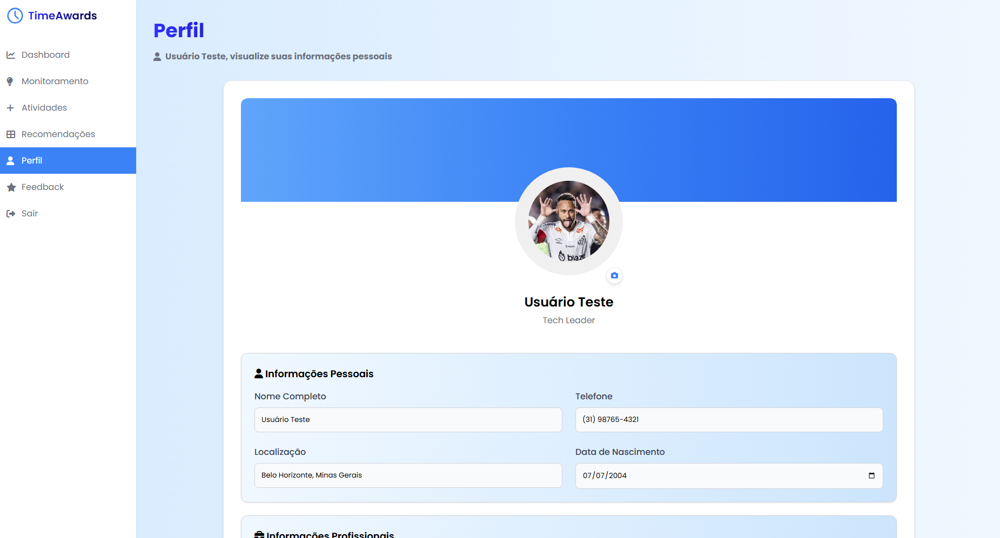
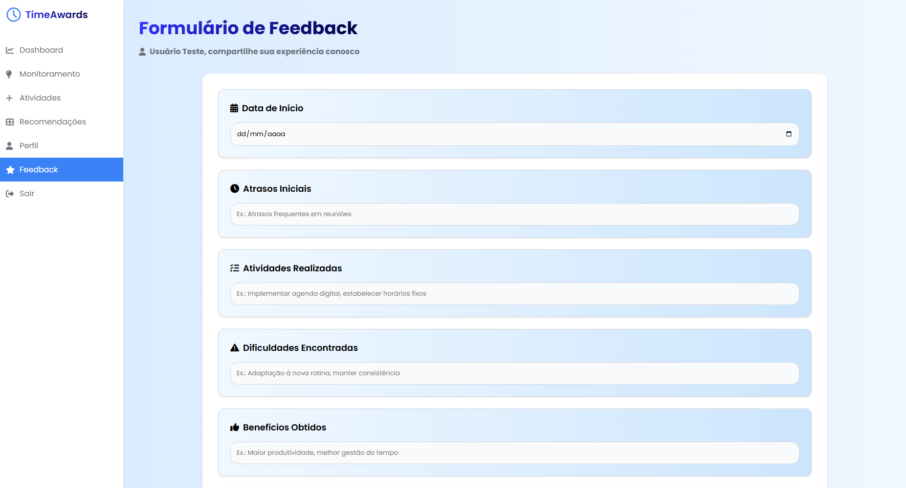

# Introdução

Este projeto, intitulado **TimeAwards**, surge no contexto do Trabalho Interdisciplinar 1 - Web (TI-1), oferecido pelo Instituto de Ciências Exatas e Informática (ICEI) da PUC Minas, com o objetivo de abordar a crescente dependência tecnológica na sociedade contemporânea. Desenvolvido por uma equipe de estudantes de Sistemas de Informação, Engenharia de Software e Ciência da Computação, o trabalho utiliza a metodologia de Design Thinking para criar uma solução inovadora: um sistema web multiplataforma que registra o tempo de uso de dispositivos eletrônicos e apresenta essas informações por meio de gráficos interativos. Essa ferramenta visa promover a conscientização sobre os hábitos digitais, oferecendo aos usuários uma análise crítica e reflexiva para equilibrar o uso da tecnologia com o bem-estar físico e mental. Inspirado em artefatos como a Matriz CSD, entrevistas qualitativas e personas definidas no repositório [https://github.com/ICEI-PUC-Minas-PPLCC-TI/atividade-01-dependencia-da-tecnologia](https://github.com/ICEI-PUC-Minas-PPLCC-TI/atividade-01-dependencia-da-tecnologia), que contém a Matriz CSD e outras documentações, o projeto busca mitigar os impactos negativos da dependência tecnológica, como perda de foco, ansiedade e isolamento social, enquanto destaca os benefícios da tecnologia quando usada de forma consciente.

A expansão dos dispositivos eletrônicos e a ubiquidade da internet transformaram as dinâmicas de trabalho, estudo e lazer, trazendo desafios como distúrbios do sono e redução da produtividade. Diante desse cenário, este trabalho propõe uma solução prática que não apenas monitora o tempo de tela, mas também educa os usuários sobre práticas saudáveis, alinhando-se aos objetivos pedagógicos e técnicos do curso. A documentação estruturada reflete o processo colaborativo da equipe, com contribuições de Rafael Xavier Oliveira, Matheus Meirelles Gomes, Lucas Silva Santos, Lucas Gabriel Pereira Teixeira e Paulo Henrique Sendas, e está hospedada no repositório mencionado, onde os artefatos do projeto estão disponíveis para consulta e evolução. Elaborado em 17 de junho de 2025, às 14:00 -03, pela equipe do TI-1.

- **Projeto:** **TimeAwards**
- **Repositório GitHub:** [https://github.com/ICEI-PUC-Minas-PPLCC-TI/atividade-01-dependencia-da-tecnologia](https://github.com/ICEI-PUC-Minas-PPLCC-TI/atividade-01-dependencia-da-tecnologia)
- **Membros da equipe:**

  - [Rafael Xavier Oliveira](https://github.com/rafaelxo)
  - [Matheus Meirelles Gomes](https://github.com/MatheusMeirellesGomes)
  - [Lucas Silva Santos](https://github.com/LucasSilvasSantos)
  - [Lucas Gabriel Pereira Teixeira](https://github.com/Lucasgpteixeira)
  - [Paulo Henrique Sendas](https://github.com/sendaspaulo)

A documentação do projeto é estruturada da seguinte forma:

1. Introdução
2. Contexto
3. Product Discovery
4. Product Design
5. Metodologia
6. Solução
7. Referências Bibliográficas

✅ [Documentação de Design Thinking (MIRO)](<files/TI-1%20(Dependência%20da%20Tecnologia).pdf>)

# Contexto

## Problema

O problema central deste projeto é a dependência tecnológica, que afeta principalmente a geração Z e outras faixas etárias que utilizam dispositivos eletrônicos de forma intensa no dia a dia. Esse contexto é marcado pela integração da tecnologia em atividades como trabalho, estudos e lazer, criando uma dependência excessiva que pode levar a impactos negativos, como perda de foco, problemas de saúde mental (ansiedade, insônia) e redução da interação humana. A aplicação será desenvolvida em um ambiente web, utilizando tecnologias modernas para atender a um público amplo e diverso. **Em um mundo cada vez mais digital, compreender e mitigar os efeitos da dependência tecnológica tornou-se uma questão urgente para promover o bem-estar individual e coletivo.**

## Objetivos

O objetivo geral deste trabalho é desenvolver um software que auxilie na gestão e conscientização do uso de tecnologias, promovendo o equilíbrio entre o uso digital e atividades off-line. Especificamente, busca-se:

1. Registrar e analisar o tempo de uso de dispositivos eletrônicos;
2. Apresentar dados em gráficos interativos para facilitar a tomada de decisão do usuário;
3. **Educar os usuários sobre práticas saudáveis de uso da tecnologia para prevenir a dependência.**

## Justificativa

A escolha deste tema justifica-se pela crescente dependência tecnológica observada na sociedade, evidenciada por entrevistas qualitativas que apontam preocupações como perda de foco e problemas de saúde. A solução proposta visa oferecer uma ferramenta prática que auxilie os usuários a monitorar seus hábitos digitais, contribuindo para uma vida mais equilibrada. Dados coletados, como os da Matriz CSD, reforçam a necessidade de abordar esse problema de forma inovadora, especialmente diante de dúvidas como "Qual será o impacto da tecnologia na saúde mental a longo prazo?". **As entrevistas foram realizadas com um grupo diversificado de usuários, e a Matriz CSD foi utilizada para organizar as certezas, suposições e dúvidas, permitindo uma análise mais estruturada do problema.**

## Público-Alvo

O público-alvo inclui jovens da geração Z (18-25 anos), estudantes e profissionais que utilizam tecnologia intensivamente, como Thomas Shelby (desenvolvedor, 35 anos), Erick Santos Cardoso (videomaker, 29 anos) e Matheus Xavier Silva (estudante, 19 anos). Esses perfis variam em personalidade e objetivos, mas compartilham a necessidade de equilibrar o uso tecnológico com a saúde mental e o lazer, sendo usuários habituais de dispositivos como notebooks, celulares e softwares de edição. **Cada persona representa um aspecto diferente da dependência tecnológica: Thomas busca eficiência no trabalho, Erick explora criativamente, e Matheus enfrenta desafios de foco nos estudos, conforme identificado no Mapa de Stakeholders que inclui educadores e reguladores.**

# Product Discovery

## Etapa de Entendimento

- **Matriz CSD**: A matriz de alinhamento identificou dúvidas como "Até que ponto a dependência da tecnologia é benéfica ou prejudicial?" e suposições como "O uso excessivo pode impactar a saúde mental", organizando informações para guiar a pesquisa. **Os insights revelaram que, embora a tecnologia facilite a vida, seu uso descontrolado pode levar a isolamento social e problemas de saúde.**
  
- **Mapa de Stakeholders**: Inclui pessoas fundamentais (usuários dependentes), importantes (familiares, educadores) e influenciadoras (reguladores de tecnologia). **Esses stakeholders desempenham papéis cruciais na compreensão e solução do problema, desde o uso direto até a regulação de políticas tecnológicas.**
  
- **Entrevistas Qualitativas**: Respostas indicam que o uso excessivo prejudica o foco e a saúde, validando suposições iniciais. **Os entrevistados relataram dificuldades em desconectar-se, como um exemplo de um participante que mencionou perda de foco em tarefas diárias.**
  
- **Highlights de Pesquisa**: Compilado das entrevistas reforça a necessidade de soluções para mitigar os efeitos negativos da dependência. **Os principais temas emergentes foram a necessidade de autocontrole, educação sobre uso saudável e ferramentas de monitoramento.**
  

## Etapa de Definição

### Personas

##### Persona 1 - Thomas Shelby

- **Idade**: 35
- **Hobby**: Baseball
- **Trabalho**: Desenvolvedor de Software
- **Personalidade**: Introvertido, confiável, calmo
- **Sonhos**: Trabalhar na Apple, conhecer o mundo
- **Objetivos Chave**: Desenvolver softwares eficientes, acompanhar tendências tecnológicas
- **Objetos e Lugares**: Notebook (trabalho), óculos de realidade aumentada (projetos)
- **Mapa de Empatia**: Thomas valoriza a eficiência e a inovação, mas luta para equilibrar o tempo de trabalho com momentos de lazer e desconexão. Seus objetivos refletem a necessidade de pausas, conforme sugerido no "detox digital" do brainstorming.
  

##### Persona 2 - Erick Santos Cardoso

- **Idade**: 29
- **Hobby**: Exploração urbana
- **Trabalho**: Videomaker documental
- **Personalidade**: Curioso, criativo, aventureiro
- **Sonhos**: Criar um documentário premiado, viajar o mundo
- **Objetivos Chave**: Aprimorar storytelling, explorar novos lugares
- **Objetos e Lugares**: Equipamentos de filmagem (trabalho), mochila de aventura (hobby)
- **Mapa de Empatia**: Erick é motivado pela criatividade e descoberta, mas enfrenta desafios em gerenciar o tempo entre produção e lazer. Seus objetivos conectam-se à ideia de "antes e depois da tecnologia" do mural de possibilidades.
  

##### Persona 3 - Matheus Xavier Silva

- **Idade**: 19
- **Hobby**: Gravar vídeos, jogar videogame
- **Trabalho**: Estudante
- **Personalidade**: Brincalhão, inteligente, impaciente
- **Sonhos**: Formar-se, morar nos EUA
- **Objetivos Chave**: Aprimoramento acadêmico, eficiência no aprendizado
- **Objetos e Lugares**: Notebook (faculdade), estúdio de gravação (hobby)
- **Mapa de Empatia**: Matheus busca sucesso acadêmico e profissional, mas luta contra distrações digitais que afetam seu foco. Seus objetivos alinham-se aos "alertas de uso excessivo" do brainstorming.
  

# Product Design

## Histórias de Usuários

Com base na análise dos desafios da dependência tecnológica identificados no PDF e no repositório [https://github.com/ICEI-PUC-Minas-PPLCC-TI/atividade-01-dependencia-da-tecnologia](https://github.com/ICEI-PUC-Minas-PPLCC-TI/atividade-01-dependencia-da-tecnologia), foram criadas histórias de usuários mais detalhadas e incrementadas, refletindo uma variedade de contextos afetados pelo uso excessivo de tecnologia, conforme definido no anexo, com insights enriquecidos do brainstorming, mural de possibilidades e entrevistas qualitativas:

| EU COMO...`USUÁRIO`                  | QUERO/PRECISO ...`FUNCIONALIDADE`                                                       | PARA ...`MOTIVO/VALOR`                                                                                                                                         |
| ------------------------------------ | --------------------------------------------------------------------------------------- | -------------------------------------------------------------------------------------------------------------------------------------------------------------- |
| Usuário que trabalha intensamente    | Registrar meu tempo de uso diário de dispositivos e pausas                              | Monitorar minha produtividade, evitar a falsa sensação de produtividade digital e promover pausas estratégicas para recarregar minha energia mental.           |
| Usuário preocupado com a saúde       | Receber alertas personalizados sobre tempo de tela e dicas de autocuidado               | Reduzir impactos como insônia causada pela luz azul, sedentarismo digital e ansiedade, protegendo minha saúde física e mental a longo prazo.                   |
| Usuário que busca equilíbrio         | Visualizar gráficos comparativos de uso antes e depois com metas ajustáveis             | Analisar como meu tempo de tela afeta meu bem-estar, planejar atividades offline e reconectar-me com hobbies, como leitura ou caminhadas.                      |
| Usuário com filhos                   | Acessar relatórios detalhados de uso dos dependentes com sugestões educativas           | Incentivar o uso consciente da tecnologia, promover interações humanas e evitar que relações fiquem em segundo plano, como nas refeições familiares.           |
| Usuário estudante                    | Obter notificações de uso excessivo e ferramentas de foco durante estudos               | Melhorar meu foco e eficiência no aprendizado, reduzir distrações digitais como redes sociais e superar a atenção fragmentada identificada nas entrevistas.    |
| Usuário ansioso                      | Participar de campanhas de "detox digital" com lembretes diários e suporte motivacional | Aliviar a ansiedade por notificações e mensagens não respondidas, adotar um uso equilibrado da tecnologia e participar de um "dia sem tela" inspirador.        |
| Usuário educador                     | Gerenciar conteúdos educativos personalizados e interativos sobre uso consciente        | Conscientizar alunos e colegas sobre os malefícios da dependência, como perda de foco e impacto na memória, e estimular o autocuidado com base em dados reais. |
| Usuário criativo                     | Receber sugestões de pausas para estimular a criatividade                               | Superar bloqueios criativos causados pelo excesso de tecnologia, como sugerido no brainstorming, e explorar novas ideias em ambientes offline.                 |
| Usuário social                       | Acessar relatórios de conectividade digital versus interações reais                     | Avaliar como a tecnologia mudou meu conceito de amizade, reduzir a sensação de solidão conectada e fortalecer laços humanos presenciais.                       |
| Usuário dependente de entretenimento | Definir limites de uso para jogos e streaming com recompensas                           | Controlar o vício digital, equilibrar o tempo de lazer com outras atividades e evitar o impacto negativo no sono e na produtividade, conforme o mural.         |

## Proposta de Valor

##### Proposta para Thomas Shelby

- **Valor**: Ferramenta que monitora tempo de uso e sugere pausas para equilibrar trabalho e saúde.
- **Benefício**: Aumenta a eficiência no desenvolvimento de software, permitindo que Thomas mantenha sua produtividade sem comprometer sua saúde mental. **Essa proposta alinha-se com a ideia de 'detox digital' e pausas sugeridas no mural de possibilidades.**
  

##### Proposta para Erick Santos Cardoso

- **Valor**: Gráficos interativos para análise de hábitos tecnológicos.
- **Benefício**: Suporte para planejar explorações e produção de conteúdo, ajudando Erick a equilibrar sua criatividade com o tempo de tela. **Reflete a sugestão de comparações visuais 'antes e depois da tecnologia' do mural.**
  

##### Proposta para Matheus Xavier Silva

- **Valor**: Alertas e relatórios para gerenciar tempo de tela.
- **Benefício**: Melhora o foco nos estudos e projetos pessoais, permitindo que Matheus alcance seus objetivos acadêmicos sem distrações. **Baseia-se na ideia de 'alertas de uso excessivo' do brainstorming.**
  

## Requisitos

As tabelas que se seguem apresentam os requisitos funcionais e não funcionais que detalham o escopo do projeto.

### Requisitos Funcionais

| ID     | Descrição do Requisito                                                                            | Prioridade |
| ------ | ------------------------------------------------------------------------------------------------- | ---------- |
| RF-001 | Permitir que o usuário registre o tempo de uso de seus dispositivos                               | ALTA       |
| RF-002 | Gerar gráficos interativos que mostrem o tempo de uso dos dispositivos de forma clara e intuitiva | ALTA       |
| RF-003 | Enviar alertas automáticos quando o tempo de uso exceder limites pré-definidos pelo usuário       | MÉDIA      |
| RF-004 | Fornecer acesso a dicas e orientações sobre como usar a tecnologia de forma saudável              | MÉDIA      |
| RF-005 | Permitir que administradores gerenciem o conteúdo educativo disponível no sistema                 | BAIXA      |

### Requisitos não Funcionais

| ID      | Descrição do Requisito                                                                                          | Prioridade |
| ------- | --------------------------------------------------------------------------------------------------------------- | ---------- |
| RNF-001 | O sistema deve ser responsivo e funcionar bem em dispositivos móveis e desktops                                 | ALTA       |
| RNF-002 | O sistema deve processar requisições e gerar gráficos em no máximo 2 segundos                                   | MÉDIA      |
| RNF-003 | Garantir a segurança e privacidade dos dados dos usuários, utilizando criptografia e boas práticas de segurança | ALTA       |
| RNF-004 | O sistema deve ter uma interface intuitiva e fácil de usar, com navegação clara                                 | ALTA       |
| RNF-005 | O sistema deve estar disponível 24 horas por dia, 7 dias por semana, com tempo de inatividade mínimo            | MÉDIA      |

## Projeto de Interface

Artefatos relacionados com a interface e a interacão do usuário na proposta de solução.

### Wireframes

Estes são os protótipos de telas do sistema.

##### Login

Cadastro e entrada do usuário.


##### Dashboard

Apresentação em gráficos com base nas atividades e na rotina do usuário corrente.


##### Monitoramento

Apresentação geral com base nas atividades e na rotina do usuário corrente.


##### Atividades

Cadastro de atividades e planejamento de rotina do usuário corrente


##### Recomendações

Apresentação de recomendações para o usuário corrente com base em suas atividades cadastras e na sua rotina analisada pela aplicação.


##### Perfil

Edição de dados do perfil do usuário corrente.


##### Feedback

Cadastro de feedback do usuário corrente acerca de sua experiência sobre a aplicação.


### User Flow

Mapa de fluxo completo das abas para o usuário.


### Protótipo Interativo

O protótipo interativo do TimeAwards permite aos usuários navegar pelas funcionalidades principais do sistema, incluindo login, dashboard, monitoramento, atividades, recomendações, perfil e feedback. O protótipo foi desenvolvido utilizando as mesmas ferramentas dos wireframes para garantir consistência visual e de experiência do usuário.

[Protótipo Interativo - TimeAwards](https://www.figma.com/design/DqvOEkzESBGfhcoDr1rdIw/Sem-t%C3%ADtulo?node-id=1-6&t=FANKncBHoJOVzUth-1)

# Metodologia

## Ferramentas

Relação de ferramentas empregadas pelo grupo durante o projeto.

| Ambiente                    | Plataforma      | Link de acesso                                                                             |
| --------------------------- | --------------- | ------------------------------------------------------------------------------------------ |
| Processo de Design Thinking | Miro            | https://miro.com/app/board/uXjVIG6LSLw=/?share_link_id=951866049481                        |
| Repositório de código       | GitHub          | https://github.com/ICEI-PUC-Minas-PPLCC-TI/atividade-01-dependencia-da-tecnologia          |
| Hospedagem do site          | Replit          | https://c4b8ad63-8b7a-48fc-b016-88b2a2478ba9-00-281zd2r1eq6gf.janeway.replit.dev/                                           |
| Protótipo Interativo        | Figma           | https://www.figma.com/design/DqvOEkzESBGfhcoDr1rdIw/Sem-t%C3%ADtulo?node-id=1-6&t=FANKncBHoJOVzUth-1                                                 |


## Gerenciamento do Projeto

### Metodologia Ágil - Scrum

O projeto TimeAwards foi desenvolvido seguindo a metodologia Scrum, com sprints de 2 semanas e reuniões diárias (Daily Standups) para acompanhamento do progresso. A equipe utilizou o GitHub Projects para gerenciar o backlog do produto, planejamento de sprints e acompanhamento de tarefas.

### Divisão de Papéis

| Papel               | Responsável                                                               | Responsabilidades                                   |
| ------------------- | ------------------------------------------------------------------------- | --------------------------------------------------- |
| **Scrum Master**    | Rafael Xavier Oliveira                                                    | Facilitação das cerimônias, remoção de impedimentos |
| **Product Owner**   | Matheus Meirelles Gomes                                                   | Definição de prioridades, validação de requisitos   |
| **Desenvolvedores** | Lucas Silva Santos, Lucas Gabriel Pereira Teixeira, Paulo Henrique Sendas | Implementação das funcionalidades, testes           |

### Cerimônias Scrum

- **Sprint Planning**: Planejamento de 2 semanas com definição de objetivos e tarefas
- **Daily Standup**: Reuniões diárias de 15 minutos para sincronização
- **Sprint Review**: Apresentação dos incrementos desenvolvidos
- **Sprint Retrospective**: Reflexão sobre melhorias no processo

### Gestão de Configuração

O projeto utiliza um modelo de branches baseado em desenvolvedores para o controle de versão. A branch `master` é a principal, contendo o código estável do projeto. Cada membro da equipe trabalha em sua própria branch individual:

- `master`: Branch principal com a versão estável do código.
- `Lucas_silva`: Branch de desenvolvimento de Lucas Silva Santos.
- `lucas-teixeira`: Branch de desenvolvimento de Lucas Gabriel Pereira Teixeira.
- `matheus`: Branch de desenvolvimento de Matheus Meirelles Gomes.
- `rafael`: Branch de desenvolvimento de Rafael Xavier Oliveira.
- `sendas`: Branch de desenvolvimento de Paulo Henrique Sendas.

As funcionalidades são desenvolvidas nessas branches individuais e, após a finalização e revisão, são integradas à branch `master`.

# Solução Implementada

## Vídeo do Projeto

O vídeo a seguir apresenta o problema da dependência tecnológica e a solução proposta pelo TimeAwards.

[](https://youtu.be/6D6pvhXOsB4)

## Funcionalidades

Esta seção apresenta as funcionalidades implementadas na solução TimeAwards.

##### Funcionalidade 1 - Login e Autenticação

Sistema de autenticação seguro para acesso ao TimeAwards.

- **Estrutura de dados:** [Usuários](#estrutura-de-dados---usuarios)
- **Instruções de acesso:**
  - Acesse a página inicial do TimeAwards
  - Insira suas credenciais de login, caso não possua uma conta clique em registrar-se e crie um perfil.
  - Clique em "Entrar" para acessar o dashboard
- **Tela da funcionalidade**:


##### Funcionalidade 2 - Dashboard com Gráficos

Visualização de estatísticas em tempo real com gráficos interativos.

- **Estrutura de dados:** [Dashboard](#estrutura-de-dados---dashboard)
- **Instruções de acesso:**
  - Após o login, o dashboard é exibido automaticamente
  - Visualize KPIs e gráficos de tempo de uso
  - Interaja com os gráficos para mais detalhes
- **Tela da funcionalidade**:


##### Funcionalidade 3 - Monitoramento de Atividades

Acompanhamento detalhado do tempo gasto em diferentes atividades.

- **Estrutura de dados:** [Monitoramento](#estrutura-de-dados---monitoramento)
- **Instruções de acesso:**
  - Acesse o menu "Monitoramento"
  - Visualize estatísticas por período
  - Filtre atividades por categoria
- **Tela da funcionalidade**:


##### Funcionalidade 4 - Cadastro de Atividades

Registro e gerenciamento de atividades do usuário.

- **Estrutura de dados:** [Atividades](#estrutura-de-dados---atividades)
- **Instruções de acesso:**
  - Acesse o menu "Atividades"
  - Clique em "Nova Atividade"
  - Preencha os dados e salve
- **Tela da funcionalidade**:


##### Funcionalidade 5 - Sistema de Recomendações

Sugestões personalizadas baseadas no uso tecnológico.

- **Estrutura de dados:** [Recomendações](#estrutura-de-dados---recomendacoes)
- **Instruções de acesso:**
  - Acesse o menu "Recomendações"
  - Visualize sugestões personalizadas
  - Aplique as recomendações sugeridas
- **Tela da funcionalidade**:


##### Funcionalidade 6 - Gerenciamento de Perfil

Edição de dados pessoais e preferências do usuário.

- **Estrutura de dados:** [Usuários](#estrutura-de-dados---usuarios)
- **Instruções de acesso:**
  - Acesse o menu "Perfil"
  - Edite suas informações pessoais
  - Configure preferências de notificação
- **Tela da funcionalidade**:



##### Funcionalidade 7 - Sistema de Feedback

Coleta de feedback dos usuários sobre a experiência.

- **Estrutura de dados:** [Feedback](#estrutura-de-dados---feedback)
- **Instruções de acesso:**
  - Acesse o menu "Feedback"
  - Preencha o formulário de avaliação
  - Envie suas sugestões e comentários
- **Tela da funcionalidade**:



## Estruturas de Dados

Descrição das estruturas de dados utilizadas na solução TimeAwards, com base no arquivo `db.json`.

##### Estrutura de Dados - Usuários

Registro dos usuários do sistema, incluindo dados de perfil e informações aninhadas como atividades e feedback.

```json
{
  "id": 1,
  "login": "Teste",
  "senha": "UserTeste@123",
  "nome": "Usuário Teste",
  "email": "teste@teste.com",
  "foto": "",
  "telefone": "",
  "data_nasc": "",
  "localizacao": "",
  "profissao": "",
  "formacao": "",
  "empresa": "",
  "habilidades": "",
  "idioma": "pt_BR",
  "notificacoes": {
    "email": false,
    "relatorio": false,
    "metas": false
  },
  "infos": [
    {
      "atividades": [],
      "feedback": [],
      "recomendacoes": [],
    }
  ]
}
```

##### Estrutura de Dados - Recomendações

Banco de recomendações que podem ser sugeridas aos usuários com base em seus hábitos.

```json
{
  "titulo": "Atividade física em dia",
  "descricao": "Continue se movimentando!",
  "relevancia": "Leve",
  "status": false
},
```

## Módulos e APIs

Esta seção apresenta os módulos e APIs utilizados na solução TimeAwards.

### Frontend

**Frameworks e Bibliotecas:**

- HTML5 - Estrutura semântica e acessível
- CSS3 - Estilização responsiva com Flexbox e Grid
- JavaScript ES6+ - Funcionalidades interativas
- Bootstrap 5 - Framework CSS para design responsivo
- Chart.js - Gráficos interativos e dinâmicos
- Font Awesome - Ícones e elementos visuais

### Backend

**Tecnologias:**

- Node.js - Runtime JavaScript
- JSON Server - API RESTful para desenvolvimento
- Express.js - Framework web (para produção)

### Hospedagem e Deploy

**Plataformas:**

- GitHub - Controle de versão e CI/CD
- Figma  - Prototipo interativo

### APIs Externas

**Serviços Utilizados:**

- Chart.js - [https://www.chartjs.org](https://www.chartjs.org)
- Font Awesome - [https://fontawesome.com/](https://fontawesome.com/)
- Bootstrap - [https://getbootstrap.com/](https://getbootstrap.com/)

# Referências

As referências utilizadas no trabalho foram:

- Alter, A. (2017). Irresistible: The rise of addictive technology and the business of keeping us hooked. Penguin Press.
- Carr, N. (2010). The shallows: What the internet is doing to our brains. W. W. Norton & Company.
- Postman, N. (1992). Technopoly: The surrender of culture to technology. Vintage Books.
- Twenge, J. M. (2017). iGen: Why today's super-connected kids are growing up less rebellious, more tolerant, less happy—and completely unprepared for adulthood. Atria Books.
- Kelley, T., & Kelley, D. (2013). Creative confidence: Unleashing the creative potential within us all. Crown Business.
- Turkle, S. (2011). Alone together: Why we expect more from technology and less from each other. Basic Books.
- Twenge, J. M., & Campbell, W. K. (2018). Associations between screen time and lower psychological well-being among children and adolescents: Evidence from a population-based study. Preventive Medicine Reports, 12, 271-283.
- Brown, T., & Wyatt, J. (2010). Design thinking for social innovation. Stanford Social Innovation Review, 8(1), 30-35.
- Orben, A., & Przybylski, A. K. (2019). The association between adolescent well-being and digital technology use. Nature Human Behaviour, 3(2), 173-182.
